# 概要
本マニュアルは、本アプリを日常的に利用するエンドユーザー（大会運営者、スコア入力者、閲覧者）向けの操作手順をまとめています。

# 前提条件
- 対応ブラウザ: Chrome / Firefox / Edge（いずれも最新の安定版を推奨）
- インターネット接続があること
- 利用に必要なアカウント（メールアドレス／パスワード）と適切な権限

# MFA設定
- 目的: セキュリティ強化
- 前提: 管理者から提供されたアクセス情報を参照できること
- 注意: セットアップキーやQRコードは機密性の高い情報です。管理者以外に共有しないでください。
- 手順:
  1. スマートフォンに TOTP 対応の認証アプリ（例: Google Authenticator、Authy）をインストールします。
  2. 管理者から提供された「アクセス情報」（セットアップキーまたはQRコード）を用意します。
  3. セットアップキーで登録する場合:
     - 管理者から渡されたセットアップキーをアプリの「キーを追加」機能で入力します。
     - アカウント名にはわかりやすい名称（例: 麻雀スコア管理）を設定してください。
  4. QRコードで登録する場合:
     - 管理者から提供されたQRコード画像をアプリでスキャンします。
  5. 登録後、アプリに表示される6桁のワンタイムパスワードが確認できれば完了です。

# ログイン
- 目的: アプリにログインしてダッシュボードへ入る
- 前提: MFAアプリが設定済みであること
- 手順:
  1. 以下のリンク or アクセス情報フォルダを開きアプリURLからアクセスします
     - [MahjonScoreManager](https://mj-score-manager-tfvp.vercel.app/login)  
  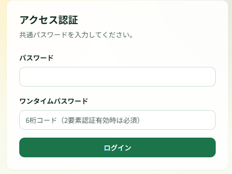
  1. 共通パスワード、GoogleAuthenticatorのワンタイムパスワードを入力
  2. 画面の「ログイン」ボタンをクリックします

# スコア入力操作
- 目的: 対局を新規登録し、スコアを保存する
- 前提: 登録するプレイヤーが事前に存在していること（未登録の場合は新規追加が可能）
- 手順（新規対局）:
  1. メニューから「スコア入力」を開きます。    
  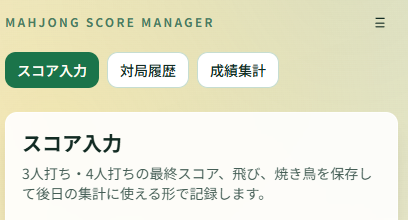
  2. 日時と参加プレイヤーを選択します。
    - プレイヤーが未登録の場合は、選択欄に名前を入力して新規追加できます。  
    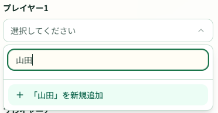
  3. 各プレイヤーのスコア、飛び／飛ばし、焼き鳥などを入力します。
  4. 役満の登録
    1. 対象プレイヤーと役満種別を選択し、「登録」をクリック（またはタップ）します。  
    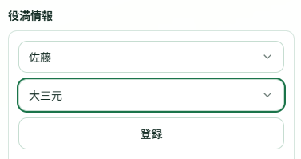
    2. 役満種別が画面にない場合は、管理メニューの「役満種別管理」から追加してください。
  5. 「保存」をクリックして対局を登録します。

- 注意: 入力形式や必須項目は画面のバリデーションメッセージに従ってください

# 対局履歴一覧
- 目的: 登録済みの対局を確認する
- 前提: 対局が登録済みであること
- 手順:
  1. 「対局履歴」を開きます。  
  
  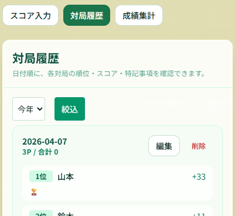
  2. 検索欄やフィルタで対象を絞ります。  
  
  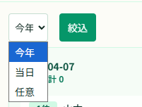
     - 「今年」を選択するとその年の対局が表示されます。
     - 「当日」を選択すると当日の対局が表示されます。
     - 「任意」を選択すると指定した期間の対局が表示されます。  
     
     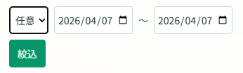

- 表示中の対局情報は画面下部の「CSV出力」からダウンロードできます（ダウンロード先はブラウザのダウンロードフォルダです）。  

# 対局編集
- 目的: 登録済みの対局を編集する
- 前提: 対局が登録済みであること
- 手順:
  1. 対局履歴で編集したい対局を検索します。
  2. 該当行の「編集」ボタンをクリック（またはタップ）します。
  3. 情報を修正し、「対局を編集」をクリックして完了します。  
  
  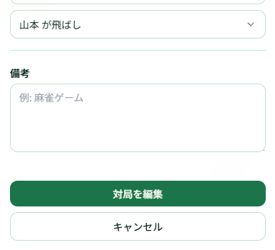

# 対局削除
- 目的: 登録済みの対局を削除する
- 前提: 対局が登録済みであること
- 手順:
  1. 対局履歴で削除対象を検索します。
  2. 該当行の「削除」リンクまたはボタンをクリック（またはタップ）します。
- 注意: 削除した対局は復元できないため、実行前に内容を確認してください

# 成績集計
- 目的: 指定した期間のランキングを表示する
- 前提: 対局が登録済みであること
- 手順:
  1. 「成績集計」を開きます。  
  
  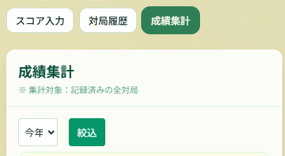
  2. 集計範囲（今年／当日／任意など）を指定して絞り込みます。
    - 「今年」を選択するとその年の集計が表示されます。
    - 「当日」を選択すると当日の集計が表示されます。
    - 「任意」を選択すると指定した期間の集計が表示されます。  

- PC 等、横幅の広い端末で表示すると表やグラフが見やすくなります。  

- 表示中の集計は画面下部の「CSV出力」からダウンロードできます（ダウンロード先はブラウザのダウンロードフォルダです）。  

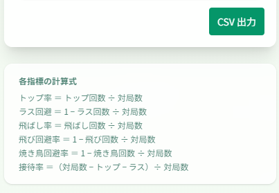

## 成績集計のソート（PC レイアウト）

PC など横幅の広い端末で表示される成績表では、各列ごとに並び替え（ソート）が可能です。画面上部の列ヘッダーをクリックすると、当該列での並び替えが実行されます。操作方法と注意点は以下の通りです。

- 操作方法:
  1. 成績集計ページをPC表示で開きます（横幅が十分あるとテーブルが表示されます）。
  2. 並び替えたい列のヘッダー（例: 合計、対局数、役満）をクリックします。
  3. クリックごとに「降順 → 昇順 → 降順」の順で切り替わります。アクティブな列には▲/▼のインジケータが表示されます。

- 対象列（例）: 名前、合計、順位、対局数、トップ回数、ラス回数、トップ率、ラス回避、飛ばし、飛び、焼き鳥、役満、飛ばし率、飛び回避率、焼き鳥回避率、接待率

- 補足:
  - 初期表示は既存の通り「合計（totalScore）降順」です。
  - 「順位」列は画面表示用の総合順位（合計得点基準）を固定で表示します。他列でソートしても順位の値自体は再計算されません。
  - ソートはクライアント側で即時に実行されます。サーバーからの再取得は行いません。
  - モバイル（カード表示）では同じ操作は提供していません。モバイルでは表示優先度やレイアウトの制約上、ソートUIは表示されません。

この機能により、特定の指標での上位者確認やデータ比較が容易になります。

# 管理メニュー
- 目的: システムに必要な情報の管理を行う
- 前提: データ修正が必要な状況
- 手順:
  1. 画面右上の「≡」メニューをクリック（またはタップ）します。  
  
  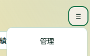
  2. 管理メニューが表示されます。  
  
  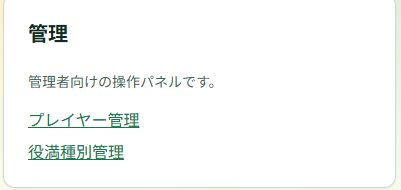

- 注意: システムの重要な操作を含むため、必要時のみ実行してください

# 管理 > プレイヤー管理
- 目的: 新しいプレイヤーの登録・編集・削除
- 前提: プレイヤー情報の修正が必要な状況
- 手順:
  1. 管理メニューを開き、「プレイヤー管理」を選択します。  
  
  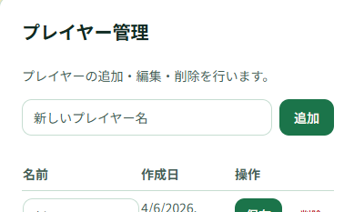
  2. プレイヤーの追加、編集（名前の修正）、削除が行えます。
- 注意: 削除したデータは復元できないため、操作には注意してください

# 管理 > 役満種別管理
- 目的: 新しい役満種別の登録・編集・削除
- 前提: 役満種別の追加・修正が必要な状況
- 手順:
  1. 管理メニューを開き、「役満種別管理」を選択します。  
  
  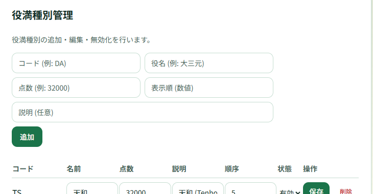
  2. 役満種別の追加、編集、削除が行えます。
     - コードは重複しないものを登録してください。
     - 順序は登録時の表示順に影響します。
     - 状態を無効にすると役満登録画面に表示されません。
- 注意: 削除したデータは復元できないため、操作には注意してください

# 管理者向け機能（概要）
- バルクインポート、バックアップ/復元などの操作は管理者が実施します。

# トラブルシューティング（代表例）
- ログインできない
  - 対処: パスワードリセット → 別ブラウザ／プライベートモードで試行 → 管理者へ連絡
- 対局が保存できない
  - 対処: 必須項目の入力確認 → ページ再読み込み → エラーメッセージのスクリーンショットを添えて管理者へ連絡

# サポートに報告する際の必須情報
- 発生日時、実行した操作、スクリーンショット（可能ならコンソールログ）、影響を受けるアカウント
